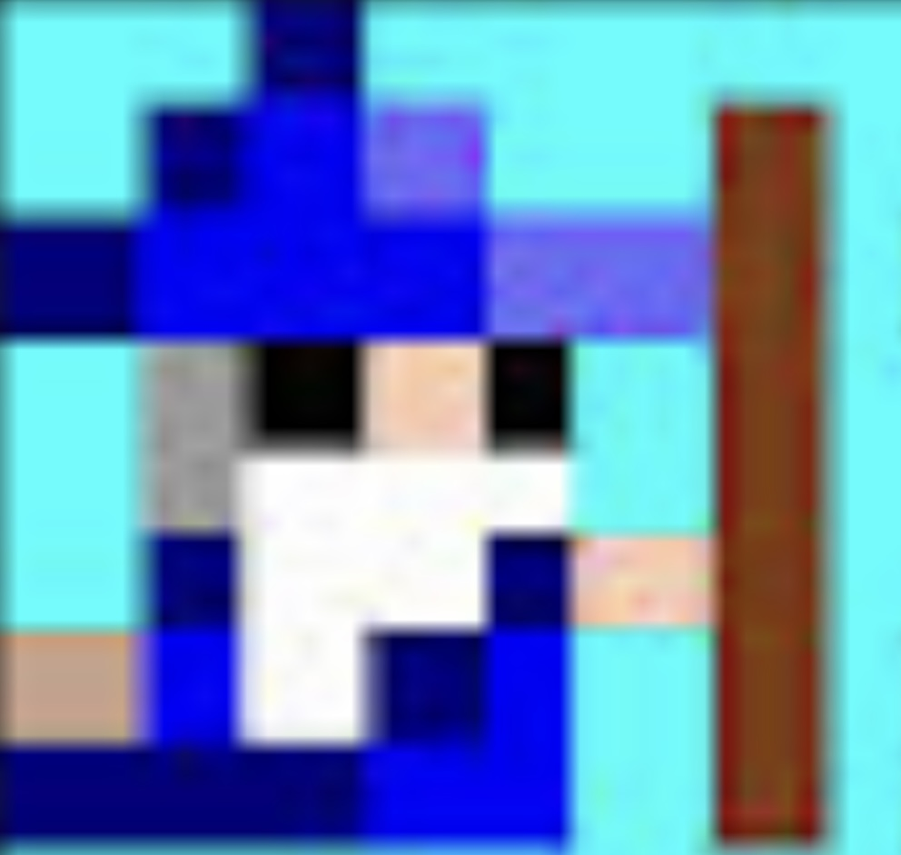

# Little Vulkan Engine

# Purpose
The purpose of this project is to learn how to use Vulkan in C++ and develop a 2d and 3d depiction of an 8x8 character image.  
To build the basic structure, I followed the YouTube playlist on Little Vulkan Engine found here:  
https://www.youtube.com/watch?v=Y9U9IE0gVHA&list=PL8327DO66nu9qYVKLDmdLW_84-yE4auCR

# Image:
## Below is the image I am trying to replicate using Vulkan.  

  

## Below is my 2d Pixel image created in Vulkan:  
